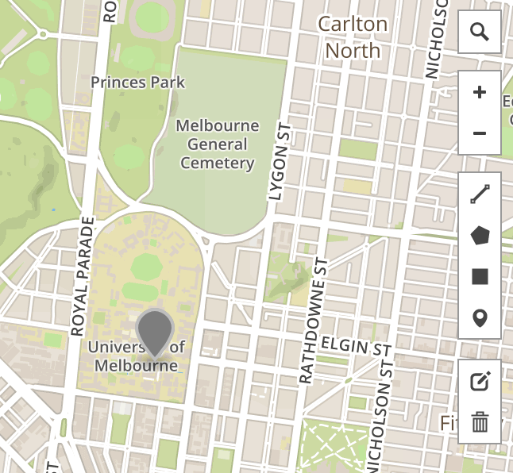

# Resistance Safe Houses

Collaboration using gitub and geojson

## Step 1: Forking

First, you want to fork this repository.


## Step  2:

Create a new geojson file:

* Go to geojson.io and use the marker icon to place a marker at the Safehouse (cafe / bar) of your choice. This creates a Feature Collection with a geometry type Point...



* Add a short review of your safehouse. In particular add:
  * Name: Cafe name
  * Address: Cafe address
  * Review: quick review or star rating
  * Contributor: your name


* Copy the geojson text displayed in geojson.io

```
  {
    "type": "FeatureCollection",
    "features": [
      {
        "type": "Feature",
        "properties": {},
        "geometry": {
          "type": "Point",
          "coordinates": [
            144.96211051940918,
            -37.79845872037568
          ]
        }
      }
    ]
  }

```


## Step  3:

Start a new file in github, using the newfile `button`. You will need to do this in __Your Fork__. Make sure you:

* create this file in the `geojsons` directory
* name this file with the .geojson extension

Once you have created the file, paste in the contents of your geojson

## Step  4:

Create a pull request
