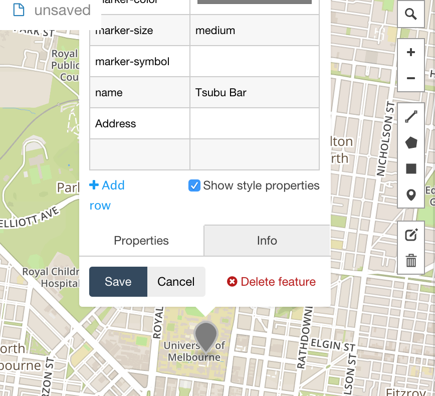

# Resistance Safe Houses

Collaboration using Gitub and geojson

## Step 1: Forking

First, you want to fork this repository.


## Step  2:

Create a new geojson file:

* Go to geojson.io and use the marker icon to place a marker at the Safehouse (cafe / bar) of your choice. This creates a Feature Collection with a geometry type Point...


* Add a short review of your safehouse. In particular add:
  * Name: Cafe name
  * Address: Cafe address
  * Review: quick review or star rating
  * Contributor: your name



* Copy the geojson text displayed in geojson.io

```
{
  "type": "FeatureCollection",
  "features": [
    {
      "type": "Feature",
      "properties": {
        "marker-color": "#7e7e7e",
        "marker-size": "medium",
        "marker-symbol": "",
        "name": "Tsubu Bar",
        "Address": "gate 6, swanston st, building 1888 university of Melbourne 3010"
      },
      "geometry": {
        "type": "Point",
        "coordinates": [
          144.96211051940918,
          -37.79845872037568
        ]
      }
    }
  ]
}

```


## Step  3:

Start a new file in github, using the newfile `button`. You will need to do this in __Your Fork__. Make sure you:

* create this file in the `geojsons` directory
* name this file with the .geojson extension

Once you have created the file, paste in the contents of your geojson

## Step  4:

Create a pull request using the `new pull request` button

## Step  5: Merging pull requests

The owner of the repository will now `merge` in the pull requests (after carefully reviewing the quality of each safehouse). Then `pull` the changes back to a local version of the repository on her computer.

## Step  6: Python Script merge the geojsons

In the local repository, running `python merge_jsons.py` will merge the new files (merge all *.json files in the geojsons directory)

## Step  7: Pull the upstream changes into your Fork

## Step  8: view the results 


#Notes

##Rendering in github

##Geojson format

##Future of collaboration

##Git lessons
